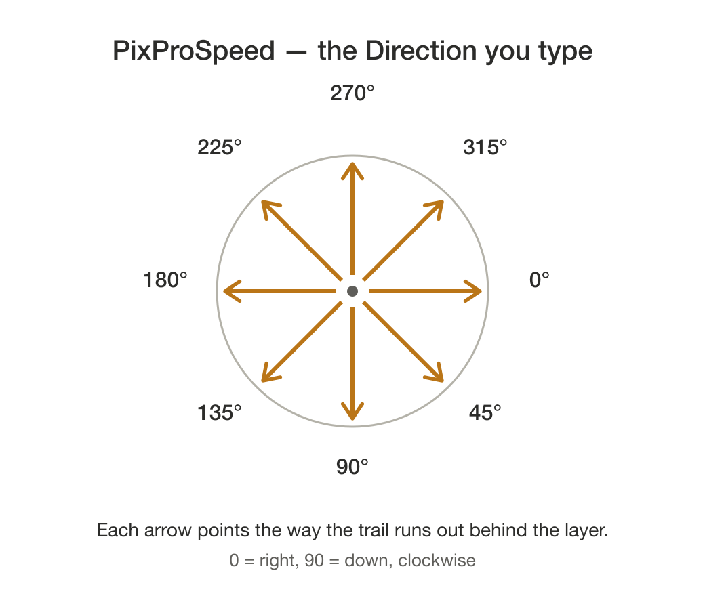

# PixProSpeed 2.7.1

Makes a Pixelmator Pro layer look like it is moving fast: a run of stutter
subimages trailing back along the direction of travel, wrapped in a soft
fading smear that spans the whole distance.

### [⬇︎ Download the latest release](https://github.com/spurious-cox/pixprospeed/releases/latest)

Notarized and stapled by Apple — open the DMG and drag PixProSpeed to Applications,
or install it with Homebrew:

```
brew install --cask spurious-cox/tap/pixprospeed
```
Requires Pixelmator Pro. Both the 3.x build and the Creator Studio build work;
the app binds to whichever one is in front or has a document open.

## Using it

PixProSpeed is a floating panel that stays above Pixelmator Pro and never takes
focus from it, so you can leave it up while you work.

1. Launch it, then select a layer in Pixelmator Pro. The panel picks it up
   within a second, shows its name, and measures a suggested direction; the
   note underneath says where that suggestion came from. The layer has to be
   at the **top level** of the Layers list; for one inside a group the panel
   says so — drag it out first and move the result back afterward.
2. Set the numbers:

   | Field | Means |
   |---|---|
   | Direction | degrees, 0 = right, 90 = down |
   | Distance | pixels, mm or math — how far the trail runs |
   | Subimages | how many stutter ghosts trail behind |

   

   The round **?** beside Measure opens the Read Me, which shows the same diagram.

   Switch **Remove background** on for a photo layer whose subject sits on a
   background.
3. Click **Create Speed**. If the trail runs the wrong way, click **Flip 180°**
   and build again — the correction is remembered for that shape.

Dismiss, or closing the window, quits it.

## What you get

A group named after the source layer: a sharp pixel copy, each ghost, the
merged smear, and your original untouched and switched off at the bottom. Every
ghost keeps its own live motion effect and opacity and the smear keeps a live
motion blur, so the result stays tunable in Pixelmator afterward.

## How it works

Step spacing uses the layer's **true rendered footprint**, measured from the
pixels of a solo export rather than taken from `width of layer` — a stroke
renders outside the path and a text layer's typographic bounds overstate its
ink, and overstating the extent spaces the smear copies too far apart, which
leaves gaps along the trail's flanks.

## Building

```
cd panel && ./build.sh
```

The app is signed with a timestamped Developer ID certificate, which keeps
macOS's Automation grant alive across rebuilds, then notarized and stapled.

## Updates

When it opens, PixProSpeed asks GitHub whether a newer release exists — at most
once a day, giving up after three seconds — and says nothing if you are up to
date or offline. If there is a newer one, it shows in the status line:

    Update available: X.Y.Z  —  brew upgrade --cask pixprospeed

It only ever reports: nothing is downloaded and nothing replaces itself.

## Problems or suggestions

Open an issue: https://github.com/spurious-cox/pixprospeed/issues

## License

MIT. See [LICENSE](LICENSE).
